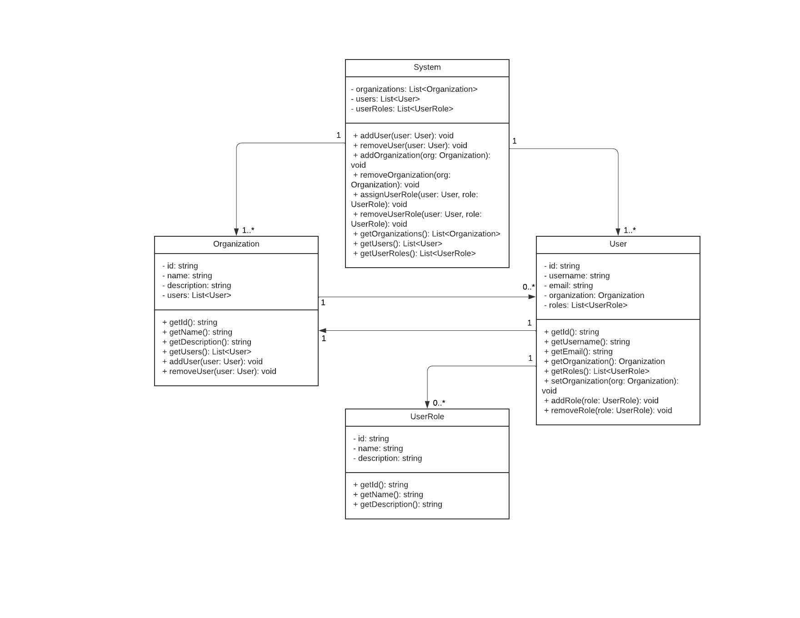

**Requirements to incorporate multiple organisations on a single OnTrack server – UML Design**

System Class: This class represents the overall system and manages organizations, users, and user
roles. It contains lists of organizations, users, and user roles. It provides methods to add and
remove users and organizations, assign and remove user roles, and retrieve lists of organizations,
users, and user roles.

Organization Class: Represents an organization within the system. It has attributes like ID, name,
and description, and a list of users associated with it. Methods allows us to retrieve information
about the organization and manage its users.

User Class: Represents a user in the system. It has attributes like ID, username, email, the
organization to which the user belongs, and a list of roles assigned to the user. Methods enable us
to retrieve user information, set the user's organization, and manage user roles.

UserRole Class: Represents a role that can be assigned to users. It has attributes like ID, name,
and description. It provides methods to retrieve role information.

**The relationships between these classes are as follows:**

- The System class manages multiple Organization objects and User objects.

Multiplicity: The multiplicity here is '1 to many' for both Organization and User. This means that
one System can manage multiple Organization objects and multiple User objects.

- Users are associated with an Organization through a reference to the organization.

Multiplicity: The multiplicity here is '1 to 1'. Each User is associated with exactly one
Organization, and each Organization is associated with exactly one User.

- Users can have multiple UserRole objects assigned to them.

Multiplicity: The multiplicity here is '0 to many' for UserRole. This means that a User can have
zero or more UserRole objects assigned to them.

- The Organization class contains a list of users associated with it.

Multiplicity: The multiplicity here is '0 to many' for User. An Organization can have zero or more
User objects associated with it.
