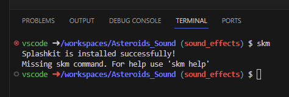
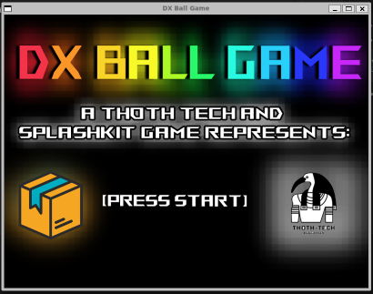
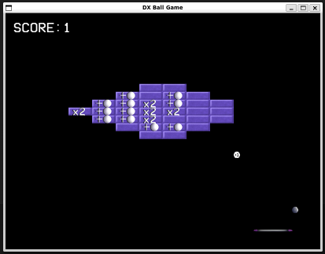

# Splashkit Windows Development Contatiner

## Introduction

This dev contatiner can be used to quickly spin up a Docker Linux enviroment sutible for C++ and C#
coding with SplashKit. This envvisoment is based on microsfots C# dev enroiment using dontnet 7.0
https://github.com/devcontainers/templates/tree/main/src/dotnet and uses VS code as an IDE

If you want to know more about dev contatiner in genral start with
https://code.visualstudio.com/docs/devcontainers/containers they are very powerful and useful and
greate when working on different projects especailly if they requrie different version of the same
framework.

## Requriments

This dev enviroment relies on WSL to display graffics and sound.

## Testing

This enviroment hs been tested on

- Windows 11 Pro 22H2
- Docker Desktop for Windows v4.22.1
- WSL 2 (5.15.90.1-microsoft-standard-WSL2)
- (WSL) Ubuntu Ubuntu 22.04.2 LTS
- (Dev Enviroment) Debian GNU/Linux 11 (bullseye)

## Fist Time Setup

### Install WSL

If you have WSL installed this can be skipped

1. Open command promt (or powershell) as Admin and run
   ```
   WSL --install
   ```
1. Check WSL is installed with ubuntu and running WSL 2
   ```
   wsl --status
   ```
   

### Docker Install

See https://docs.docker.com/desktop/wsl/ for detail around docker and WSL

1. Download Docker Desktop for windows https://www.docker.com/products/docker-desktop/
1. Run the downloaded install `Docker Desktop Installer`, Accept UCA controle and click ok to
   install.
1. If prompted to Enable WSL during installtion click yes.
1. Once Installed check WSL is enabled

   - Got to settings
   - Genral
   - Ensure `Use the WSL 2 based engin` is checked

   

### Setup VS Code

This guide assumes you already have VS Code Installed

1. Open Vs Code
1. Search the exstension store for Dev Containers by microsoft or Marketplace Link:
   https://marketplace.visualstudio.com/items?itemName=ms-vscode-remote.remote-containers
1. Install the plugin

# Using Splashkit Dev Contatiner

<!-- update this text once the dev contatiner is listed on the market place.-->

## Setup

At this stage you will have to manaully add the dev container to your project.

1. Copy the [.devcontainer](docs/Splashkit/DevEnviroment/Windows_DevContainer/.devcontainer) folder
   and past it in your project directory.
1. In VS Code click open remote window in the bottome left hand corner
   
1. This will open the Remote Windows opetions in the Command Palette, select `Reopen in Container`

   

1. This will start building the container not this will take a while (2-5 Mins on a good PC) You can
   watch the progress by clicking Starting Dev Container (showlog)
   
1.  Your Dev Contatiner should now be ready for
   use.

## Testing your Dev Container

1. Open a terminal in VS Code, this should open a terminal in the remote contatiner. Note user
   VSCode and you should be in /workspaces/[Project]

   ```
   Terminal > New Terminal
   ```

1. Run the `skm` to ensure skm is installed and working, if skm is not found try clsoing and
   reopening the terminal.

   

1. Test Video and Sound to validate the contatiner, a windowed version of DXBall has been included
   in the .devcontainer folder
1. Change to the DXBall Folder and run the DXBallGame (note ifyou don't cahgne folders the game can
   not find the resources folder)
   ```
   cd .devcontainer/DXBall/
   ./DXBallGame
   ```
1. Game Window Will open, Press 1 to start, left and right arrows to move, esc to exit



